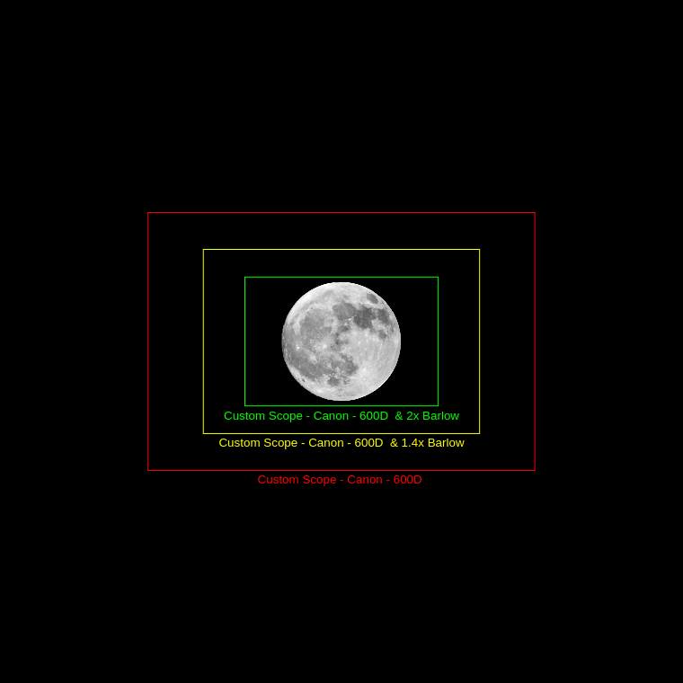

# Formes de prise de vue — 28 août 2026, Tournefeuille

Étude (branche `docs/formes-prise-de-vue`). Hypothèses de travail : [DEC-010](decisions.md).
Parc optique : [DEC-009](decisions.md). Site : [tournefeuille-2026.md](lieux/tournefeuille-2026.md).

Ce n’est **pas** encore un plan de séance. Pas de scripts LEM, pas de tables d’expo
(calculatrice Jubier / Espenak = backlog).

---

## 1. Idées d’entrée (observateur)

1. **Time-lapse d’ambiance** — paysage + évolution de la lumière. Un intervallomètre
   à réglage unique peut suffire. Référence : Guillaume Cannat, éclipse **totale**
   du 21 janvier 2019 — Sony A7s, 20 mm f/3, poses 2,5 s à 800 ISO
   ([Autour du Ciel](https://www.lemonde.fr/blog/autourduciel/2019/01/)).
   Le bracketing AEB validé à Frías ([chapelet-lecons-sem.md](chapelet-lecons-sem.md))
   est réutilisable si l’on veut plus d’une couche.
2. **Le même run peut nourrir un chapelet** si LEM varie vitesse et ISO de façon
   ciblée (au lieu d’un réglage unique).
3. **La pénombre (P1) est quasi invisible à l’œil** ; elle n’apparaît qu’en photo.
   Hypothèse : réduire les prises à l’**entrée dans l’ombre (U1)**.
4. **HDR** pour une vue plus proche de l’œil : umbra cuivrée **et** croissant
   encore éblouissant — pas seulement un croissant, l’ombre étant « invisible »
   en pose unique.

---

## 2. Ce que 2026 n’est pas (vs Cannat 2019)

Cannat a tourné **deux boîtiers en parallèle** : lunette ~800 mm motorisée pour
les phases, et 20 mm pour l’ambiance « du milieu de la nuit à l’aube ». C’est
le même schéma matériel que DEC-009 (750 mm EQ + grand-angle fixe).

| | 21 janv. 2019 (Cannat) | 28 août 2026 (Tournefeuille) |
|--|------------------------|------------------------------|
| Type | **Totale** | Partielle profonde, mag. **0,93** — **pas de totalité** |
| Lumière au MAX | Clair de Lune effondré, étoiles visibles | ~7 % du disque encore hors umbra → paysage **encore éclairé** |
| Fin de séance | Totality → aube | MAX 06:13, **moonset 07:20**, Soleil déjà levé (alt +0,8°) |
| Capteur ambiance | A7s plein format, très propre à ISO 800 | 100D / 600D APS-C 2011-13, plus bruyants |
| FOV 20 mm FF | ~84° × 62° | 15 mm APS-C ≈ 73° × 53° (un peu plus serré) |

L’ambiance 2026 sera une **baisse** de lumière + bascule vers l’aube, pas la
nuit étoilée d’une totalité. Le duo « gros plan suivi + grand-angle fixe »
reste le bon modèle ; on ne recopie pas les 2,5 s / 800 ISO sans essai sur le
100D.

Cannat note aussi (même billet) que la baisse en **pénombre** n’est pas
spectaculaire à l’œil, mais se montre facilement **en photo, à expo constante**,
en comparant des vues à quelques minutes d’écart. Ça recoupe l’idée 3 et
conditionne l’idée 1.

---

## 3. Conflit d’exposition (idée 1 vs idée 2)

Un **seul** programme d’expo ne peut pas servir les deux produits.

| Produit | Expo qui le sert | Effet collatéral |
|---------|------------------|------------------|
| Time-lapse **ambiance** | Expo de base **constante** ; **AEB** ±2 EV pour l’aube et le choix des vues | Disque souvent cramé sur la vue centrale ; l’histoire de lumière se lit sur **une** couche |
| **Chapelet** du disque | Rampe LEM / tables (plusieurs EV d’umbra) | Paysage « normalisé » : plus d’histoire de lumière |
| **HDR œil** (idée 4) | Plusieurs poses au même instant | Naturel sur le 750 mm suivi ; trop peu de pixels Lune au 15-85 |

D’où [KI-013](known-issues.md) : ne pas promettre « un run LEM = ambiance + chapelet »
sans **bracketing assez large** pour séparer les couches en post.

L’AEB du 100D (±2 EV, 3 vues, 6 fichiers via « C » = 2 cycles) couvre **4 EV**.
L’écart croissant uneclipsé ↔ cœur d’umbra est plutôt **8–12 EV**. Suffisant
pour un filet paysage / Lune petite, **insuffisant** pour un HDR « vision
humaine » du disque. Ce HDR appartient au **600D @ 750 mm**, pas au wide.

---

## 4. Formes candidates

### Forme A — Ambiance (time-lapse 100D, **privilégiée**)

- **100D** + EF-S 15-85 @ **15–20 mm**, trépied fixe, intervallomètre + **AEB**
  (leçon Frías : retardateur « C », AEB en dernier).
- Fenêtre : **peu avant U1 → moonset** (viser ~04:20–07:20). Pas P1 (03:24).
- L’AEB (±2 EV, 6 vues via « C ») sert trois choses : nuit qui change, **lever
  du Soleil** dans le même run, **choix** des vues en post (pas un HDR disque).
- Pour un time-lapse « histoire de lumière », se tenir à **une** couche du
  bracket (ou à une règle fixe). Mélanger les couches normalise l’aube et
  efface l’ambiance.
- Intervalle time-lapse (souhait 10–30 s) ≠ intervalle chapelet (3–4 min).
  Le pas *réalisable* avec AEB « C » = 2 est plutôt 60–90 s ; ce n’est pas
  la durée du film ([§13](#13-volume-de-prises-deux-boîtiers)). Un run
  dense permet un chapelet en post (1 vue sur N).

### Forme B — Chapelet à rampe (LEM sur le *même* wide)

- Même cadrage que A, mais LEM (ou paliers ISO/vitesse à la main) suit le disque.
- Produit : chapelet U1→set. **Détruit** l’ambiance si on n’a qu’une expo par
  position. Viable seulement si brackets larges (plutôt LEM que AEB ±2).
- Condition : LEM démarre et voit le 100D ([KI-006](known-issues.md), [KI-007](known-issues.md)).
- Disque à 18–25 mm : ~80–120 px — chapelet « position dans le paysage », pas
  le détail de l’ombre.

### Forme C — HDR disque 600D (privilégiée)

- **600D** au foyer du 150 mm f/5 (**750 mm**), monture **équatoriale**.
- FOV APS-C paysage, Ø Lune 0,51° (Skyfield MAX) :

  | Train | FOV | Marge autour du disque | Dérive 1′/min → sortie |
  |-------|-----|------------------------|------------------------|
  | Foyer 750 mm | 1,70° × 1,14° | 0,60° × 0,31° | ~19 min (confortable) |
  | + 1,4× Canon | 1,22° × 0,81° | 0,35° × 0,15° | ~9 min (un peu de marge — **à tenter**) |
  | + doubleur Hoya | 0,85° × 0,57° | 0,17° × **0,03°** | ~2 min (très serré) |

*Comparaison [astronomy.tools](https://astronomy.tools/calculators/field_of_view/) : foyer (rouge), ×1,4 (jaune), doubleur (vert). Confirme le foyer confortable, une marge au 1,4×, un cadrage très serré au ×2.*

- Au foyer, une dérive de monture ne jette pas la Lune hors champ tout de suite.
  Le 1,4× reste tenable si on surveille. Le doubleur exige une mise en station
  soignée (ou un cadrage portrait, qui échange les marges) — [KI-012](known-issues.md).
- Fenêtre : **U1 → aussi loin que le ciel le permet** (voir §8) ; MAX est encore
  dans la fenêtre utile.
- Produit : HDR croissant + umbra. LEM sur ce boîtier si le Mac suit ; sinon
  brackets manuels, MAX dédié ([KI-010](known-issues.md)).
- **Ne pas** porter le pipeline HDR couronne solaire.

### Forme D — Ambiance 70–200 (repli paysage)

- Si un **premier plan agréable** se présente (horizon Ouest–SO), **l’une** des
  deux séquences A ou C peut céder la place à des vues d’ambiance au
  **70–200 mm f/4**, éventuellement + 1,4× (280 mm).
- Ce n’est pas un troisième corps : on **remplace** A (wide) *ou* on détourne
  le 600D du télescope — pas les deux en plus.
- U1→set (~40°) ne tient pas à 70–200 : recentrages, ou quelques poses autour
  du MAX / du coucher, pas un time-lapse continu du trajet.

---

## 5. Split à deux boîtiers (recommandation d’étude)

C’est le schéma Cannat, adapté à DEC-009 :

| | Boîtier | Forme | Expo | Automatisation |
|--|---------|-------|------|----------------|
| Gros plan | **600D** @ 750 mm EQ (± 1,4×) | **C** (HDR disque) | Rampe / brackets | LEM si le Mac le permet, sinon manuel aux contacts |
| Paysage | **100D** @ 15-85 15–20 mm | **A** (ambiance) | **AEB** ±2 EV | Intervallomètre + « C » |

Pourquoi LEM sur le 600D plutôt que sur le wide : c’est là que la dynamique
umbra/croissant exige une rampe ; le 100D gagne à rester autonome (leçon SEM
DEC-013). Si LEM ne part pas, la forme C survit en manuel ; la forme A ne
dépend déjà pas du Mac.

Le split n’est **pas** un choix de capteur. Mesures DxOMark (RAW) : les deux
boîtiers sont équivalents (voir §9).

Idée 2 (LEM → chapelet sur le wide) : **repli**, pas le plan A. On ne
sacrifie pas l’ambiance pour un chapelet de 100 px si le 750 mm fait déjà le
disque.

---

## 6. Idée 3 — partir de U1

| Corps | P1 (03:24) | U1 (04:34) |
|-------|------------|------------|
| 750 mm / HDR | Peu utile (pleine Lune) | **Début retenu** — la bite umbrale est le sujet |
| Wide ambiance | Seule façon de *montrer* la pénombre (expo fixe) | Suffit si l’on raconte umbra + aube seulement |

Hypothèse retenue : **peu avant U1** pour le 100D (~04:20) et **U1** pour le
600D. P1 (03:24) n’est plus dans le plan privilégié.

---

## 8. Aube vs umbra — le ciel au maximum est-il trop clair ?

Doute : au MAX le Soleil se lève ; des poses longues pour l’umbra seront-elles
noyées dans l’aube ?

**Non au MAX, oui en fin de run.** Skyfield DE421, Tournefeuille, 2026-08-22 :

| Instant CEST | Soleil | Lune | Ciel (déf. usuelle) |
|--------------|--------|------|---------------------|
| U1 04:34 | −26° | 24,5° / az 225° | **Nuit** astronomique |
| 05:30 | −18° | 17° | Début crépuscule astronomique |
| 06:08 | −12° | 11,3° | Début crépuscule **nautique** |
| **MAX 06:13** | **−11,2°** | **10,5° / az 245°** | Nautique ; Soleil à l’**est** (az 64°), écart 179° |
| 06:44 | −6° | 5,6° | Début crépuscule **civil** |
| 07:15 | 0° | 0,7° | **Lever du Soleil** |
| Moonset 07:20 | +0,8° | 0° | Jour |

Au maximum on ne « lève » pas encore : le Soleil est **11° sous l’horizon**,
côté opposé à la Lune. Le ciel *derrière* le disque (ouest–SO) reste sombre
à l’échelle nautique. L’umbra (typiquement 8–12 EV sous le croissant) reste
**plus lumineuse que ce fond** : des poses de quelques secondes au 750 mm f/5
sur monture suivie sont réalistes. Le vrai problème au MAX n’est pas l’aube,
c’est le **croissant encore éblouissant** → HDR / rampe, pas une pose unique
longue.

La fenêtre se ferme **après** le MAX :

- Jusqu’à ~06:40 (encore nautique, Lune ~6°) : poses umbra encore défendables,
  ciel ouest qui blanchit doucement.
- Dès le **crépuscule civil (06:44)** : le fond de ciel monte vite ; une pose
  longue « pour accrocher l’umbra » ramasse l’aube et noie le contraste.
- Après le **lever (07:15)** : Lune à 0,7°, airmass énorme, ciel de jour —
  l’umbra est perdue. Il reste éventuellement le croissant (pose courte) jusqu’au
  moonset.

Donc : viser l’umbra **U1 → MAX et un peu après** (jusque vers 06:40). Garder
le 600D allumé jusqu’au coucher seulement si l’on accepte des vues croissant /
silhouette, plus de l’umbra cuivrée.

Le 100D AEB, lui, *doit* aller jusqu’au moonset : c’est là que l’aube entre
dans le cadre, et c’est pour ça que le bracket existe.

---

## 9. Capteurs 600D vs 100D (DxOMark)

Même silicium de famille : APS-C 22,3 × 14,9 mm, 18 Mpx, 5184 × 3456, pas ~4,3 µm.
Le 600D reprend le capteur du 550D
([revue DxO](https://www.dxomark.com/canon-eos-600d-in-depth-review/)) ;
le 100D est dans la lignée 700D / EOS M (Hybrid CMOS AF II en plus, pas un
saut d’image)
([revue DxO](https://www.dxomark.com/canon-eos-100d-rebel-sl1-kiss-x7-review-diminutive-size/)).

| Mesure RAW DxO | 600D (DIGIC 4) | 100D (DIGIC 5) | Écart |
|----------------|----------------|----------------|-------|
| Score global | 65 | 63 | 2 pts (seuil usuel de notable ~4) |
| Couleur | 22,1 bits | 21,8 bits | 0,3 bit |
| Dynamique | 11,5 EV | 11,3 EV | **0,2 EV** |
| ISO « sports » (SNR 30 dB) | 793 | 843 | ~0,1 EV |

**L’ISO « sports » ~800 n’est pas l’ISO de travail optimal.** C’est le *plus haut*
ISO auquel le capteur tient encore SNR 30 dB (mesure DxO *Low-Light*) — un
**plafond d’action**, pas un sweet spot. La dynamique *Landscape* (11,5 / 11,3 EV)
est mesurée au **plus bas ISO**. Sur ces 18 Mpx, la courbe DR est **plate de
100 à 400** (bruit de lecture qui mange le gain analogique), puis elle
**descend** : ISO 800 a *moins* de dynamique photographique que 100, pas plus
([revue 600D](https://www.dxomark.com/canon-eos-600d-in-depth-review/)).
« Meilleur ISO 800 » en ciel profond, c’est encore autre chose (§11, ISO-less).

Insignifiant pour l’éclipse : même nombre de pixels sur la Lune à focale égale,
même tenue des ombres, même bruit à ISO 800–1600. Les ISO natifs plus hauts
du 100D (12 800 vs 6 400) sont surtout une étiquette DIGIC 5 ; en RAW mesuré
le haut ISO n’est pas un cran au-dessus.

Les deux héritent du bruit de lecture Canon 18 Mpx à bas ISO (courbes
ISO 100–400 qui se recouvrent dans les ombres, DR plafonnée). D’où le HDR /
la rampe sur le **disque**, quel que soit le boîtier au foyer : 11,5 EV labo
ne tiennent pas croissant + umbra (pourquoi : §11). L’écart utile face à un
Nikon/Sony 2012–13 (~1–2 IL de DR) est le même pour les deux.

Le split 600D télescope / 100D ambiance est **ergonomique** (écran articulé,
batterie, Hybrid AF, taille), pas un choix de performance capteur.

---

## 10. Et si on passait à l’OM System (OM-3 / OM-5 II) ?

Question : des boîtiers et optiques **plus légers** apporteraient-ils un gain
pour *cette* éclipse ? **DxOMark n’a pas publié** de test capteur de l’OM-3
ni de l’OM-5 Mark II (août 2026). On s’appuie donc sur :

- les mesures **DxO officielles** du plus proche 20 Mpx MFT testé en labo :
  [E-M1 Mark II](https://www.dxomark.com/olympus-om-d-e-m1-mark-ii-sensor-review-new-standard/)
  (80 / 23,7 bits / **12,8 EV** / ISO 1312) ;
- les PDR **PhotonsToPhotos** (Bill Claff) des boîtiers actuels :
  OM-3 **9,64**, OM-5 II **9,79** (identique à l’OM-5), OM-1 9,54, E-M1 III 9,74
  ([annonce OM-3](https://asobinet.com/info-sample-om-3-photons/),
  [OM-5 II](https://asobinet.com/photons-to-photos-releases-sensor-test-results-for-the-om-5-mark-ii/)) ;
- [DPReview OM-3](https://www.dpreview.com/reviews/om-system-om-3-review/) :
  même capteur empilé que l’OM-1 II, dynamique et ombres « aussi bonnes ».

Les chiffres *en italique* des agrégateurs (style « DxO 78 / 13,7 EV » pour
OM-3 / OM-5 II) sont des **estimations** par taille/âge de capteur, pas un
passage au labo DxO. Ne pas les citer comme mesures.

### Capteur : MFT 20 Mpx vs Rebel 18 Mpx

| | 600D / 100D (DxO) | Proxy MFT mesuré (E-M1 II, DxO) | OM-3 / OM-5 II |
|--|-------------------|----------------------------------|----------------|
| Format | APS-C 22,3×14,9 mm (332 mm²) | Four Thirds 17,3×13 mm (225 mm²) | idem |
| Pixels | 18 Mpx, 5184×3456 | 20 Mpx, 5184×3888 | 20 Mpx, 5184×3888 |
| Score / DR / ISO sports | 65–63 / 11,5–11,3 EV / ~800 | **80 / 12,8 EV / 1312** | pas de DxO ; PDR ~9,6–9,8 |
| Silicium | CMOS 2011–13, bruit de lecture élevé à bas ISO | 20 Mpx 2016 | OM-3 : **stacked BSI** (OM-1 II). OM-5 II : Live MOS **non stacked** (même que OM-5) |

À iso-échelle PhotonsToPhotos, les OM actuels sont **dans le même paquet**
(~9,6–9,8 de PDR max) : le stacked de l’OM-3 n’améliore presque pas le RAW
statique (PDR même légèrement sous l’OM-5 II). L’écart **mesuré DxO** utile
est donc E-M1 II vs 600D : **+1,3 EV** de dynamique labo, **+0,7 EV**
d’ISO sports. Réel, mais loin d’un cran de format (un Nikon APS-C 2016 est
encore ~1 EV au-dessus de l’E-M1 II d’après la même revue DxO).

Pour le **disque** (forme C) : le trou croissant/umbra reste 8–12 EV. Gagner
~1 EV de DR réduit un peu le nombre de brackets, ça ne supprime pas le HDR.
Même largeur en pixels (~5184) : le détail limbe est comparable ; le seeing
et la focale dominent.

**Crop 2× vs 1,6× au foyer 750 mm** — le champ MFT est plus serré :

| | APS-C 600D | MFT (17,3×13 mm) |
|--|------------|------------------|
| FOV 750 mm | 1,70° × 1,14° | **1,32° × 0,99°** |
| Marge autour du disque 0,51° | confortable | encore tenable, moins de dérive |

Le 1,4× sur MFT se rapprocherait du doubleur actuel sur APS-C (très juste).

### OM-3 vs OM-5 II (entre eux)

PDR quasi identique. Le stacked sert la **rafale / l’AF / l’obturateur
électronique**, pas l’umbra. Pour une nuit d’éclipse :

| | OM-3 | OM-5 II |
|--|------|---------|
| Poids | 496 g | **414 g** |
| Batterie (CIPA) | **590 vues** | 310 vues — juste pour 3 h d’AEB |
| IBIS | 6,5 EV | 5 axes (famille OM-5) |
| Étanchéité | IP53, magnésium | étanchéité « aventure », plus compact |

L’IBIS ne sert **pas** sur trépied verrouillé ni sur équatoriale suivie.
L’OM-5 II est le plus léger ; l’OM-3 tient mieux un time-lapse long.

### Gain pour *ce* projet ?

| Besoin 28 août | Gain OM ? |
|----------------|-----------|
| Umbra + croissant (HDR) | Faible (~1 EV). Le 750 mm et LEM/brackets restent le sujet. |
| Time-lapse AEB nuit→aube | Modéré : haut ISO / DR un peu meilleurs ; Live Composite / Live Time éventuellement pour l’ambiance. |
| Poids | **Oui sur les optiques** (12–40, 12–45, 40–150 vs 15-85 + 70–200 L), pas sur le télescope 150 mm. Boîtier : 100D (407 g) ≈ OM-5 II ; 600D (570 g) un peu plus lourd que l’OM-3. |
| Pilotage LEM | **Perte.** LEM = Canon USB, macOS ≤ Mojave ([KI-001](known-issues.md), [KI-006](known-issues.md)). Un OM passe en intervallomètre / OM Capture, plus de rampe Jubier native. |
| Bague T au foyer | Possible (T-ring MFT), à valider (tirage, tilt). |

**Conclusion d’étude :** un passage OM allège le **parc grand-angle / 70–200**,
améliore un peu le RAW par rapport aux Rebel 2011–13, et n’apporte **pas**
de gain décisif sur le corps 750 mm (le plus critique). Il **casse** le fil
LEM. Ne pas changer de système *pour* l’éclipse du 28 août ; éventuellement
plus tard si le poids des zooms devient le vrai frein, en acceptant de
piloter le gros plan sans LEM.

---

## 11. Combien de poses au 750 mm ? (dynamique + liseré)

Sources : table [Jubier](http://xjubier.free.fr/en/site_pages/lunar_eclipses/Lunar_Eclipse_Photography.html)
(LEM s’en sert) ; contraste visuel [Espenak](http://www.mreclipse.com/Special/appearance.html)
(~**500×** soit **~9 EV** entre pénombre encore éclairée et umbra, d’où l’ombre
« noire » à l’œil) ; retours HDR 4–9 vues
([Kurita 2022](https://stellarscenes.net/eclipse_e/le2022_02.htm)).

### Écart à un instant donné (MAX, mag. 0,93)

Ce n’est **pas** l’écart pleine Lune → totalité centrale (~15–18 EV, hors sujet
ici : pas de U2). C’est **croissant / zone pénombrale vs umbra sur le même
disque**.

Jubier, colonne **ISO 100 · f/5,6** (proche du f/5 du 150 mm) :

| Cible | Temps indicatif | vs pleine Lune (1/1000) |
|-------|-----------------|-------------------------|
| Pleine Lune | 1/1000 s | 0 |
| Reliquat hors umbra mag. 0,10 → 0,05 | 1/60 → 1/30 s | +4 à +5 EV |
| Umbra type L=4 (claire) | 2 s | +11 EV |
| Umbra type L=3 | 8 s | +13 EV |
| Umbra type L=2 (plus fréquente) | 30 s | +15 EV |

Jubier : en partielle, **ne pas** exposer « à la surface encore éclairée » —
la zone pénombrale varie déjà de **plusieurs IL**. La ligne « partial magnitude »
expose le *reliquat clair*, pas l’umbra. Il faut les deux + les intermédiaires.

### Pourquoi 11,5 EV DxO n’éliminent pas le HDR

Les **11,5 EV** du 600D (DxO *Landscape*, §9) mesurent jusqu’où le capteur
*détecte encore un signal*, pas jusqu’où on photographie proprement croissant
**et** umbra sur la même vue. Une RAW unique ne tient pas les deux. L’AEB
natif (±2 EV, 3 vues) ne couvre que **4 EV** de span — trop peu.

**DxO Landscape n’est pas 11,5 EV propres.** Le score descend jusqu’à
SNR ≈ 1 (signal = bruit), après normalisation à 8 Mpx. Les 2–3 derniers IL
sont un gris granulaire sans couleur. La dynamique *photographique*
([PDR](https://www.photonstophotos.net/GeneralTopics/Sensors_&_Raw/Sensor_Analysis_Primer/Engineering_and_Photographic_Dynamic_Range.htm)
PhotonsToPhotos, seuil SNR ≈ 20) est plutôt **~9–10 EV**. Le liseré
turquoise (§ suivant) exige du rapport signal/bruit, pas un fond à SNR = 1.

**Les deux bouts de la DR ne sont pas interchangeables.** Le croissant
clippe de façon irréversible (et flare sur tout le disque). Il faut le
placer en haut de la RAW, avec ~1 IL de marge. L’umbra est alors
**9–13 IL plus bas** (table Jubier ci-dessus : L=4 ≈ +11 EV, L=3 ≈ +13 EV
vs 1/1000 s) — sous le plancher utile. Exposer pour l’umbra explose le
croissant.

**Chaque RAW est une fenêtre qu’on glisse**, pas un seau de 11 EV à poser
sur la scène. Avec 7 vues à 2 IL, chaque zone du disque (croissant,
pénombre, bord d’umbra, cœur) tombe dans le *milieu propre* d’au moins une
vue ; le merge prend ces milieux. Deux extrêmes seulement (1/1000 s + 4 s)
couvriraient le span mais laisseraient le gradient et le liseré soit
cramés sur la longue, soit noyés sur la courte.

Un capteur à ~14 EV labo **réduirait** le nombre de vues (plutôt 5 que 7) ;
il n’éliminerait pas le HDR. Le trou Jubier L=2 peut aller à **+15 EV** vs
pleine Lune.

### Protocole retenu (forme C, un instant)

Le span n’est pas « nombre de vues × pas ». Entre *n* poses régulièrement
espacées il y a **n − 1** intervalles :

**span = (n − 1) × pas** → 7 vues, pas de 2 EV → 6 × 2 = **12 EV**
(de la plus courte à la plus longue). « 7 × 2 EV » désigne le *protocole*
(7 fichiers, 2 IL d’écart), pas 14 EV de dynamique.

| Niveau | Nombre | Pas | Span *(n−1)×pas* | Rôle |
|--------|--------|-----|------------------|------|
| Minimum | **5** | 2 EV | 8 EV | Croissant + umbra si l’éclipse n’est pas trop sombre |
| **Retenu** | **7** | **2 EV** | **12 EV** | Couvre ~500× d’Espenak + une marge Danjon |
| Chasse au liseré | **9** | 1,5–2 EV | 12–16 EV | Plus de tons moyens sur le *bord* d’ombre |

Exemple au foyer f/5, ISO 100, base 1/1000 (pleine Lune) : 1/1000, 1/250,
1/60, 1/15, 1/4, 1 s, **4 s**. À ISO 200, la plus longue tombe à 2 s — plus
sain vers 06:13–06:40 (KI-014). Si l’umbra est un L=2 sombre, ajouter une
8ᵉ vue (~8–15 s) **seulement** tant que le ciel nautique le permet.

Pas un stack toutes les 30 s : **aux instants clés** (U1+10 min, ~50 %, MAX,
éventuellement 06:30). Entre les stacks, une vue « milieu » ou la rampe LEM
suffit. Le 600D AEB ne remplace pas cette séquence : LEM ou bracketing manuel
(MAX dédié, KI-010).

### ISO 800 : ça raccourcit les temps, pas le nombre de vues

Trois notions distinctes se recouvrent autour de « 800 » ([KI-017](known-issues.md),
[DEC-012](decisions.md)) :

| Sens de « ISO 800 » | Ce que c’est | Pour cette éclipse |
|---------------------|--------------|-------------------|
| DxO *Sports* 793 / 843 | Plus haut ISO encore « propre » à SNR 30 dB | Plafond, pas un réglage à viser |
| « Best ISO » ciel profond ([table Canon](https://dslr-astrophotography.com/iso-values-canon-cameras/)) | Début de zone *ISO-less* : au-delà, le gain analogique n’améliore plus le bruit de lecture rapporté à la scène. **600D : 800** (DR Sensorgen ~10,2) ; **100D : 400** (10,5 à 400 / 9,9 à 800 — pas 800) | Utile pour *une* pose longue d’un champ faible (DSO). Le disque lunaire n’est pas ce problème. |
| ISO de travail du stack HDR | Où on place la rampe 7 × 2 EV | Voir ci-dessous |

Monter de 100 à 800, c’est **+3 EV d’amplification** : toute la rampe glisse
de 3 IL vers des temps plus courts. Le **contraste de scène** croissant/umbra
(8–12 EV, table Jubier plus haut) ne bouge pas. Le span à couvrir non plus.
On garde **7 vues × 2 EV**. ISO 800 n’offre pas plus de dynamique par RAW
(il en offre moins) : on ne passe pas à 5 vues « parce que le capteur est
optimal à 800 ».

Ce que ISO 800 **fait** : la plus longue du stack passe de 4 s à **0,5 s** —
meilleur contre le ciel qui blanchit (KI-014) et plus rapide à enchaîner.
LEM a le droit de **mélanger ISO et vitesse** le long de la rampe (c’est
même le cas d’usage de la calculatrice Jubier) ; ce n’est pas « tout verrouiller
à 800 et couper des brackets ».

**Exception 1/4000 s** — les deux Rebel plafonnent là. Jubier, pleine Lune,
ISO 100 · f/5,6 : **1/1000 s**. Au foyer f/5, ≈ 1/1250. À ISO 800 : ≈ **1/10 000 s**.
1/4000 est alors **~1,3 IL trop lent** : le limbe encore plein (U1, début de
partielle) **clippe**. L’exception est donc vraie **tôt**, pas au MAX :

| Instant | Partie claire vs pleine Lune | À ISO 800 · f/5, plus courte du stack |
|---------|------------------------------|----------------------------------------|
| U1 (~pleine Lune + bite) | ~0 EV | 1/4000 **crame** (~1 IL de trop) → ISO **100–200** sur les vues courtes |
| MAX (reliquat mag. 0,93) | +4 à +5 EV (Jubier 1/60–1/30 @ ISO 100) | 1/500–1/250 — **1/4000 suffit** ; ISO 400–800 tenable |

Recette d’étude, forme C : **vues courtes à ISO 100–200 tant que le croissant
est éblouissant** ; **vues umbra à ISO 400–800** pour rester sous ~1–2 s après
06:13. Ce n’est pas une séquence plus courte, c’est la même à temps décalés.

Sur le **100D** (AEB, ISO *fixe*, la vitesse varie) : ISO 800 **raccourcit le
cycle** (la vue +2 EV n’est plus à 16 s si la centrale était à 4 s), donc aide
le plancher 60–90 s du §13. Ça ne réduit pas les **6 JPEG** par impulsion.

### Le liseré bleu / turquoise (pas vraiment « vert »)

Ce n’est pas un liseré chlorophylle. C’est la **bande turquoise** au *bord*
de l’umbra : lumière rasante qui traverse surtout la **couche d’ozone**
(absorption de Chappuis dans le jaune–rouge). Cannat, Jubier (L=2 : « border
… may be brighter and **blueish** »), [PBS / Spaceweather](https://www.pbs.org/newshour/science/ozone-challenge-can-see-turquoise-lunar-eclipse),
[S&T](https://skyandtelescope.org/online-gallery/the-ozone-fringe-during-the-lunar-total-eclipse/).

- Largeur angulaire typique **~2′** (très étroit vs le disque ~31′).
- Couleur **cyan / bleu-vert**, souvent pâle ; difficile à l’œil (« ozone
  challenge ») ; plus nette en photo / jumelles.
- Maximum d’évidence près du **bord d’umbra**, surtout autour de U2/U3 d’une
  *totalité*. En 2026 il n’y a **pas** de totalité : le croissant reste
  éblouissant (mag. 0,93). Le liseré peut quand même apparaître le long de
  l’arc d’ombre au MAX, **si** on a des poses *intermédiaires* et qu’on ne
  force pas toute l’image vers le cuivre en post.
- Rate si on ne prend que 2 vues (croissant cramé + umbra très longue) : le
  bord tombe entre les deux, saturé ou noyé.

D’où les **7 vues** : les 3ᵉ–5ᵉ du stack sont celles du liseré. Traiter en
balance plutôt « lumière du jour », pas un WB trop chaud.

---

## 13. Volume de prises (deux boîtiers)

Pas un script LEM, pas un plan d’expo Jubier. Ordre de grandeur + intervalle de
travail, avec le matériel annoncé : **cartes 16 Go**, **2 batteries par boîtier**.
Le protocole 7 × 2 EV (span, DxO, liseré) reste au §11.

Hypothèse : [DEC-011](decisions.md). Piège cartes : [KI-016](known-issues.md).

### Intervalle ≠ durée de la vidéo

**Intervalle 60–90 s** = pas de l’**intervallomètre** : temps entre deux
impulsions (chaque impulsion = 6 fichiers si « C » = 2). Ce n’est **pas** la
durée du film.

La durée du time-lapse, pour **une** couche du bracket, est :

**durée vidéo = (durée de séance / intervalle) / fps**

Fenêtre 100D ~04:20 → 07:20 ≈ **180 min** (10 800 s).

| Intervalle boîtier | Images (1 couche) | Film à 25 fps | Film à 12 fps |
|--------------------|-------------------|---------------|---------------|
| 20 s | 540 | 22 s | 45 s |
| 30 s | 360 | 14 s | 30 s |
| **60 s** | **180** | **7 s** | **15 s** |
| **90 s** | **120** | **5 s** | **10 s** |
| 3–4 min | 45–60 | 2–2,5 s | 4–5 s |

Un film cible de **60–90 s** à 25 fps exigerait 1 500–2 250 images, donc un
intervalle boîtier de **5–7 s** — incompatible avec AEB « C » = 2 et des poses
nuit. L’ambiance 3 h → clip se *comprime* : viser **~10–20 s de film** (12 fps
sur un pas 60–90 s, ou 25 fps sur un pas plus court si l’essai AEB le permet),
pas une minute.

Les 10–30 s du §4 restent un *souhait* time-lapse. Le plancher réel est le
cycle AEB (ci-dessous).

### Plancher AEB (« C » = 2)

Chaque impulsion enchaîne **deux** cycles ±2 EV. En M, l’AEB joue sur la
**vitesse**. Temps d’obturation d’une impulsion ≈ 2 × (t₋₂ + t₀ + t₊₂), plus
vidage carte.

Exemple, vue centrale 4 s : 1 s / 4 s / 16 s × 2 ≈ **42 s** d’obturation.
Ajout dump + marge → intervalle utile **≳ 60 s**, souvent **~90 s**. Une
cadence 20 s n’est possible que si la pose centrale est courte (type 1–2 s)
*et* si l’écriture est rapide (JPEG, pas six CR2).

D’où le candidat de travail : **90 s** (sûr accus + cycle) ; **60 s** si
l’essai nuit montre une centrale assez courte et qu’on accepte un changement
d’accu en cours de run ([KI-009](known-issues.md) : l’AEB s’efface à
l’extinction — le réarmer **après** le swap).

### 100D — JPEG ou RAW ? (ambiance → vidéo)

Le produit est un **film d’ambiance** (et un chapelet sous-échantillonné), pas
un HDR disque. Le 5184×3456 sera de toute façon réduit (1080p / 4K).

| | JPEG Fine L (~6,4 Mo, ~2 470 vues / 16 Go) | RAW CR2 (~24 Mo, ~620 vues / 16 Go) |
|--|-------------------------------------------|-------------------------------------|
| 3 h × 6 fich. / impulsion à **90 s** (720 fich.) | **~4,6 Go** — tient | **~17 Go** — **déborde** 16 Go |
| idem à **60 s** (1 080 fich.) | **~6,9 Go** — tient | **~26 Go** — déborde |
| Écriture | rapide → aide le plancher d’intervalle | 6 CR2 : dump long |
| Aube | l’AEB ±2 EV *est* le filet (choisir la couche) | plus de latitude si la centrale est fausse |
| Ciel nuit | 8 bits : banding possible sur le fond | meilleur pour des stills d’expo |

**Retenu pour le 100D : JPEG Fine + AEB**, WB daylight, une couche pour le
film (règle : rester sur 0 EV tant que les hautes lumières tiennent, passer
sur −2 EV à l’aube, éventuellement un court fondu — ne pas mélanger les
couches image par image, ça normalise la lumière, [KI-013](known-issues.md)).

Ce n’est pas « on jette la qualité » : à 18 Mpx, un Fine L reste largement
au-dessus d’une Full HD. Le coût réel est le ciel 8 bits et l’impossibilité
de récupérer une centrale trop loin — d’où l’essai AEB nuit + aube (backlog)
pour caler t₀.

**Rejeté :** RAW+JPEG (les deux poids, la carte meurt) ; RAW seul sur le 100D
sauf à passer à 3–4 min (alors ce n’est plus un time-lapse, c’est un
chapelet — 270–360 CR2 ≈ 7–9 Go, ça tient, mais le film fait 2–5 s).

Le **600D reste en RAW** : le merge 7 × 2 EV a besoin des CR2.

### 100D — volume (JPEG Fine, « C » = 2)

| Intervalle | Impulsions / 3 h | Fichiers | Carte 16 Go | 2× LP-E12 (CIPA 380 × 2 = 760) |
|------------|------------------|----------|-------------|-------------------------------|
| 60 s | 180 | 1 080 | OK (~7 Go) | **juste** : 1 080 déclenchements > 760 CIPA |
| **90 s** | **120** | **720** | OK (~5 Go) | **OK CIPA** (720 ≲ 760) |
| 3–4 min | 45–60 | 270–360 | OK | large |

CIPA compte 50 % de flash : sans flash, écran éteint, le réel est en général
meilleur. **90 s** est le défaut qui tient avec **2 accus sans swap**. **60 s**
= plus de film (~15 s à 12 fps au lieu de ~10 s) mais **changement d’accu**
vers 05:30–05:40, AEB réarmé, ne plus éteindre ensuite.

MAX manuel sur le wide si le trou d’intervalle est large ([KI-010](known-issues.md))
— à 90 s ce n’est plus critique, une impulsion tombera à ±45 s du MAX.

### 600D — stacks + vues entre les stacks

Fenêtre umbra **U1 04:34 → ~06:40** (~126 min). Après 06:44 : croissant /
silhouette seulement (KI-014). RAW, 16 Go largement suffisant.

**4 stacks** × 7 RAW aux instants du §11 :

| Instant | CEST (approx.) |
|---------|----------------|
| U1+10 min | 04:44 |
| ~50 % (milieu U1–MAX) | 05:23 |
| MAX | 06:13 |
| 06:30 (encore nautique) | 06:30 |

= **28 RAW**. Entre les stacks, **1 vue « milieu »** toutes les **3–4 min**
(ou la rampe LEM si le Mac suit) : ~30 RAW. Total forme C : **~60–90 RAW**
(~1,5–2 Go). 2× LP-E8 : sans enjeu (≪ 440 CIPA × 2).

Pas un stack toutes les 30 s. Le MAX reste un déclenchement **dédié**
(KI-010), même sous LEM.

### Fourchette de séance

| | Fichiers | Volume | Accus |
|--|----------|--------|-------|
| 100D JPEG Fine, **90 s**, « C » = 2 | ~720 | ~5 Go / 16 Go | 2 packs, sans swap |
| 600D RAW, 4 stacks + milieu 3–4 min | ~70–90 | ~2 Go / 16 Go | 2 packs, large |
| **Total** | **~800** | **~7 Go** (une 16 Go / boîtier) | 2+2 accus |

(À 60 s sur le 100D : ~1 080 JPEG / ~7 Go, et un swap d’accu.)

Ce n’est pas encore un script LEM ni un calage de t₀. L’essai AEB 100D
nuit + aube décide si 60 s est tenable (pose centrale assez courte) ou si
90 s reste le plancher. ISO 800 sur ce run (si la centrale nuit le permet)
raccourcit surtout la vue +2 EV, donc le *cycle*, pas le nombre de fichiers
([§11, ISO 800](#iso-800--ça-raccourcit-les-temps-pas-le-nombre-de-vues)).

---

## 14. Ouvert (prochaine passe)

- [ ] Essai AEB 100D de nuit + aube simulée (même chaîne « C » que Frías) ;
      caler la vue centrale pour la nuit, laisser ±2 EV absorber l’aube ;
      mesurer le plancher d’intervalle réel (60 vs 90 s).
- [ ] Test Mac LEM + USB 600D ; tenter le 1,4× sur le 750 mm (dérive).
- [ ] Brancher la calculatrice LEM / Jubier sur la séquence **7 × 2 EV** (f/5),
      ISO mixte 100–200 (vues courtes, U1) / 400–800 (umbra).
- [ ] Repérage premier plan Ouest–SO : déclenche ou non la forme D (70–200).
- [ ] Confirmer l’horizon réel (clôture de la fenêtre umbra vers 06:44).
